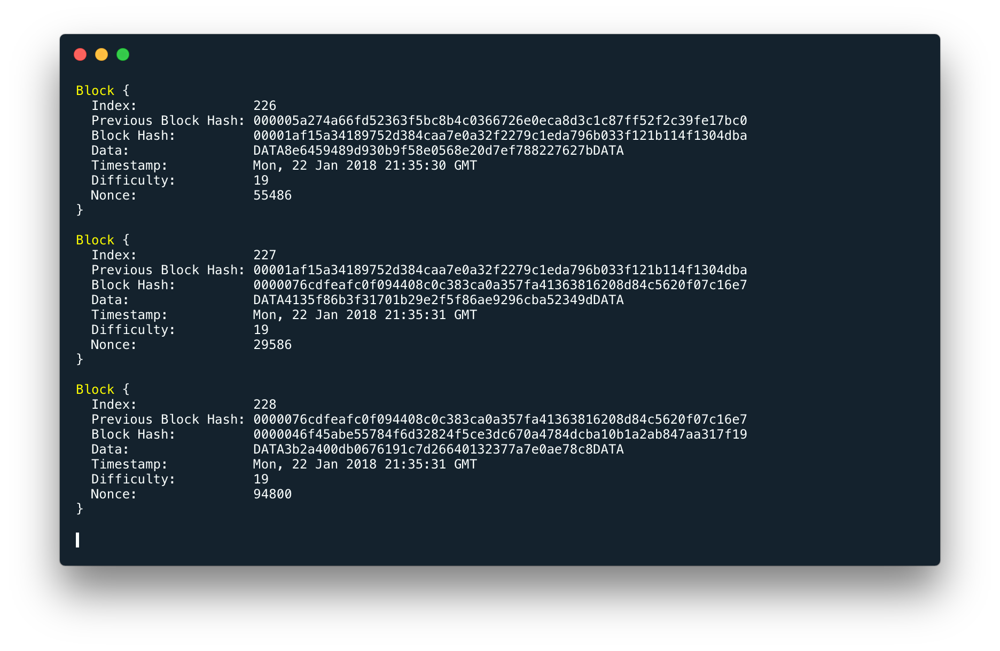
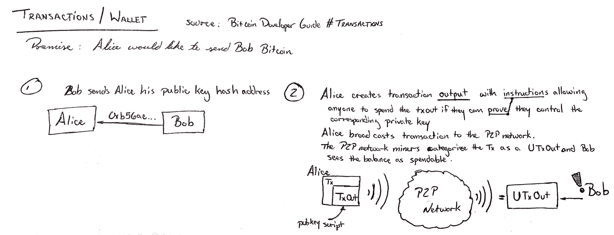
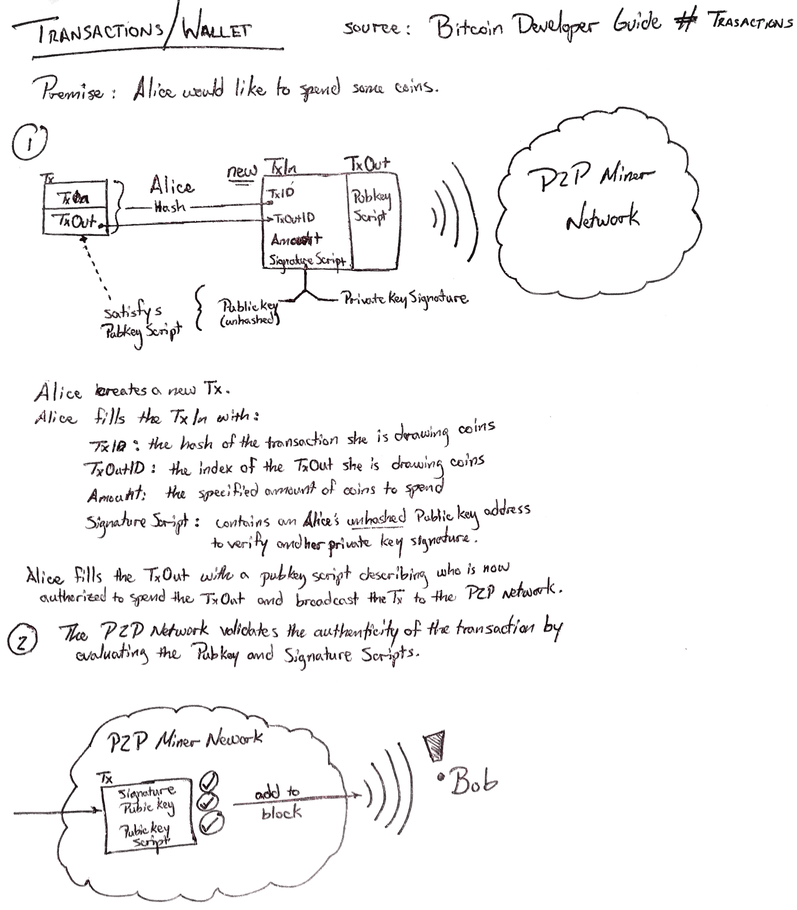
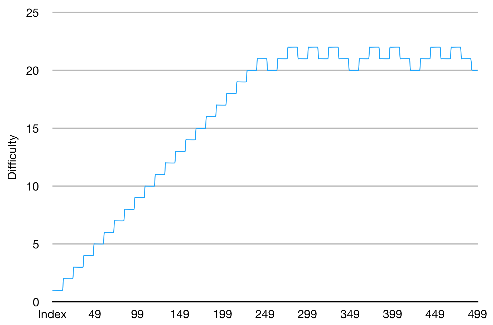

<h1 align=center>Blockchain Technology Example</h1>


<p align=center>Functioning example of the blockchain implementation from this repo.</p>

## Motivation
I wanted to expand my professional career and found immense potential in the BlockChain technology. This repo is intended to be a growing summation of my research and is focused specifically into the technology itself apart from its applications.

## Usage
### Prerequisite
Make sure you have [Docker](https://www.docker.com/community-edition) installed.
### Install
Clone the source and perform:
```bash
npm start
```
### Stop
In your terminal, hit `Control-C` **2X**, then:
```bash
docker container ls
docker stop <container-name>
```
(*Easier*) You may opt to open another shell and perform the above commands instead.

## "Whitepaper"
### Block and Blockchain Defined
At its core, a _**block**_ is a data structure that maintains properties that are unalterable; a change to the structure changes its identity irreparably. In general, all blocks have the following properties:
+ **index** identifies the block in sequence
+ **hash** a `sha256` hash of all block properties
+ **previous hash** the hash of the block preceeding this block in the chain
+ **timestamp** the data and time the block was added to the chain
+ **data** can be, literally, anything

*Hash*, perhaps the most important block property, is a `sha256` (or some other cryptographic hash) hash of all other block properties. Should a block property be altered, the hash too is altered, clearly indicating block validity and tampering.

The *data* property is also quite important. Generally, for variant blockchain implementations such as CryptoCurrency, this property holds the accumulations of *transactions*. Other implementations, such as Ethereum, use this property for *contract definitions* with the `Solidity` language.

Other properties such as `difficulty` and `nonce` are included in the Block identity as well and are discussed in more detail in the section [The Proof-of-Work Puzzle](#the-proof-of-work-puzzle). Furthermore, a block can have other properties depending on the blockchain implementation; however, those additional properties should, in general, always be included in caclulation of the *hash* property.

A _**blockchain**_ (commonly synonymous with *ledger*) refers to the ordered accumulator of valid blocks. As implied, the chain must be *ordered* and constantly *validated*; however, it is not necessary for the contained block indexes to be in ascending order. [Merkle Trees](https://en.wikipedia.org/wiki/Merkle_tree) are commonly used to for validated efficiency in many blockchain implementations.

### The Proof-of-Work Puzzle
In the context of blockchain technology, "Proof-of-Work" is, at its simplest, a hash puzzle that the computer must solve. The key to Proof-of-Work is that *it must be costly to solve*, in terms of technical resources, but *easy to verify* by peers. Blockchain **mining** is the act of solving this puzzle.

By incorporating "Proof-of-Work" into blockchain design, we gain a few advantages. Perhaps the most important is protecting the Peer2Peer network from Denial-of-Service (DoS) attacks. It allows time for information to populate across the Peer2Peer network and be validated, ensuring block data is not duplicated ("Double Spent"). Moreover, we instill trust in this automated distributed network knowing that data was not populated "out of thin air".

#### Mining, Difficulty and "Finding" a Block
The Proof-of-Work concept is where *mining* really derives its significance. Imagine mining for diamonds in a volcanic tunnel with a pickaxe. Every time your pickaxe hits that rock, you experience a chance to find a diamond. But, it's difficult -- the more you mine, the deeper you traverse the volcanic tunnel which increasingly becomes more rock and less diamond ore.

Blockchain mining is very similar. The action of striking the rock, in the paragraph above, is analogous to a computer's **hash rate**. The fact that the volcanic tunnel is becoming more like rock as you mine can be thought of as the **difficulty** to find a diamond -- or a block in our terms. Finding a diamond is analogous to **finding** or "mining" a block, etc.

More technically, the difficulty is set globally on the peep-to-peer network and governs how quickly computer hardware can hash a given block on average. **Mining** is the action of taking the hash from a valid block (formed by the current client) and, given a specified algorithm, rehashing it with a *nonce* until the resulting hash matches a given requirement. In the case of Bitcoin, should the current client be first in discovering a nonce to produce the required result, that client is credited with "Finding a Block", awarded an incentive, and the block is added to the ledger after a peer consensus. The faster the hash rate, the greater the odds of mining a block successfully before all other peers on the network.

#### Nakamoto Consensus
The Nakamoto Consensus is, in fact, named after Satoshi Nakamoto, inventor of both Bitcoin and its underlying BlockChain technology. Simply, the [Proof-of-Work Puzzle](#the-proof-of-work-puzzle) described above can be considered as set of rules that govern block validation and chaining. However, consider a scenario where the chain may be forked. The **Nakamoto Consensus** is the concept that because of the [Proof-of-Work](#the-proof-of-work-puzzle) rules above together with the [miner's incentive](#mining-incentive), miners will naturally maintain the same chain of blocks.

#### Proof-of-Work vs Proof-of-Stake
Proof-of-Work (a concept most popularized by [Bitcoin](https://en.bitcoin.it/wiki/Proof_of_work)) is defined by a protocol that governs how blocks are mined in conjunction with the inherent competition of miners to be the first to mine and include their block in the blockchain. The competition is the most determining factor in Proof-of-Work; however, there are some disadvantages. The most significant stems from the enormous electrical expenditure being and entirely inefficient when considering that all miners are mining the same block in competition for inclusion to the blockchain.

Proof-of-Stake seeks to improve efficiency by removing the incentive for miners to include their block in the blockchain and resting solely on transaction fees (see the section [Miner Incentive](#miner-incentive)). Instead, a variety of deterministic algorithms are currently in development that will chose a miner to author a block in the chain. Obviously, the efficiency gain is enourmous; however, its potential impact on the effect of the [Nakamoto Consensus](#nakamoto-consensus) is still uncertain.

Due to current technological advancement, it is worth noting that while [Ethereum](https://github.com/ethereum/wiki/wiki/Proof-of-Stake-FAQ) is still currently a Proof-of-Work system at the writing of this publication, it is the leading blockchain implementation that is popularizing the use of Proof-of-Stake.

### Peer-to-Peer Architecture
This is contradictory to a Client-Server model which denotes the exchange of information from a Client device to a centralized location of stored data. In Peer2Peer, each client (peer, node, or miner) has equal access to the exchange of information present among other peers. For the BlockChain technology, this means each peer maintains a *valid* copy -- *not identical* given [Merkle Trees](https://en.wikipedia.org/wiki/Merkle_tree) -- of the current blockchain in the network.

It is this decentralization of data that gives the BlockChain technology its incredible security advantage and is perhaps the most important aspect of the technology. The volume of valid blockchain copies in the network is enormous, and together with Proof-of-Work, the network can easily identify false blockchains, blocks, and block data.

### BlockChain vs CryptoCurrency
It is commonly confused that BlockChain technology and CryptoCurrency are synonymous; however, CryptoCurrency is solely an application of its underlying BlockChain technology. In this case, the *data* property of blocks in the blockchain hold **transactions**. Each transaction holds an amount of cryptographic "coins" given a programmatic type thus denoting currency.

#### Transactions
A **transaction** is a data structure and a type of commonly included data in a block's *data* property. For many CryptoCurrencies in general such as Bitcoin, there are two parts to a transaction -- **TxIn** and **TxOut**. The *TxIn* is a sub data structure that contains the *amount* of crypto coins *spent* from a previous TxOut. Likewise, a *TxOut* is a sub data structure that denotes the action of *spending* the crypto coins contained in the TxIn.

More simply, think of a transaction as a box of cookies. Each box has a top (input) and a bottom (output). For sake of example, cookies (crypto coins) can only be input through the top of the box by another box; thus, another box "spends" cookies to your box. You can then spend cookies through the bottom of the box to a subsequent box.

#### The Wallet
The **wallet** is another data structure that holds transactions with unallocated TxOuts. More complicated implementations can also verify and perform transactions. For example, suppose a TxOut does not "spend" all of its accompanying TxIn amount; the wallet will effectively perform 3 transactions. First, it completes the TxOut with the corresponding TxIn amount. Second, a new instance of the transaction data structure is instantiated whose TxIn is filled with the desired amount. Third, another transaction is instantiated with the TxOut directed back to the spending wallet.

Bitcoin transactions simplify the process by including a secondary TxOut with each transaction that acts as the **Change TxOut**. The transaction is broadcasted on the Peer2Peer network, a miner fee is deducted, and a new transaction is instantiated with the TxIn corresponding to the Change TxOut amount of the broadcasted transaction. With Bitcoin, it is important that this extra data structure is included in each transaction since excess portions of any transaction defaults to becoming a part of miner fees.

Now, consider a user would like to spend more than the amount of a singular TxIn. A conglomeration of transactions with TxIns summing to the amount desired or more are spent. The change is recovered using the process previously exampled.

As a result of the preceding example, we observe a general rule:
> The transaction flow can have many incoming transactions, but only 2 transactions may result from the process -- 1 to send the desired amount and 1 to send the change back to the spending wallet.

It is also important to note, again, that unspent transactions discussed in these examples are formally known as **UTxOut** (Unspent Transaction Outputs). This is especially relevant for CryptoCurrencies such as Bitcoin.

Perhaps the more important aspect of a CryptoCurrency wallet is its ability to maintain one or more cryptographic addresses. A "wallet **address**" is really the *hash* of a *Public Key* from a Public/Private cryptographic key pair.

##### Receiving (Bitcoin Example)
For Bitcoin, consider a user, Alice, who wants to send an arbitrary amount to Bob. Bob, first, gives Alice the *hash* of his wallet's Public Key. Alice then performs the _**task**_ of creating a TxOut with a *Public Key Script* that contains Bob's public key and "instructions" on how he can *prove* that he has the corresponding private key to spend the transaction. Alice, then, broadcasts the transaction to the miners on the Peer2Peer network who then categorize the transaction as an UTxOut. That categorization involves another broadcast which Bob hears and registers as an amount he is now authorized to spend ([Bitcoin Transactions](https://bitcoin.org/en/developer-guide#transactions)). Note the illustration:



It's important to note that at no point did Alice "have" the transaction she used to send Bob the desired amount. When Alice performed the _**task**_ of "creating a TxOut", she implicitly spent one or many UTxOut that she was authorized to spend, like Bob at the end of the previous example.

##### Spending (Bitcoin Example)
To spend a transaction, Alice, first, instantiates a new transaction instance. The TxIn is populated with a *hash* (TxID) and the the *index* of the TxOut (TxOutID) belonging to the transaction Alice is referencing to spend. The TxIn is, then, populated with the *amount* desired and a combination of her un-hashed Public Key address and a signature from her Private Key. The combination thereof is known as the *Signature Script* and undoubtedly authorizes Alice to spend the TxOut. Finally, just like our example with Bob, Alice populates the TxOut with the Public Key Script identifying Bob's Public Key address ([Bitcoin Transactions](https://bitcoin.org/en/developer-guide#transactions)). Note the illustration:



#### Mining Incentive
By opinion, here is where BlockChain technology and its application of CryptoCurrency become near inseparable. Satoshi Nakamoto, inventor of the BlockChain, stated,
>The system is secure as long as honest nodes collectively control more CPU power than any cooperating group of attacker nodes. - [Satoshi Nakamoto](http://nakamotoinstitute.org/bitcoin/)

Miners not only create new blocks, perform proof-of-work, and validate the blockchain by consensus. They also validate the authenticity of transactions and, through the [Nakamoto Consensus](#nakamoto-consensus), maintain a secure network by their volume. As a result, the value of an "honest" BlockChain miner is innumerable and appropriates the need for an incentive to invite and retain a large number of them.

In Bitcoin, a miner who is successfully credited with the creation of a block is awarded 1.0 Bitcoin ([Satoshi Nakamoto](http://nakamotoinstitute.org/bitcoin/)). Additionally, every transaction experiences a 0.00001 Bitcoin (1,000 [Satoshi](https://bitcoin.org/en/glossary/denominations)) minimum miner fee in order to broadcast a transaction to the Peer2Peer network ([Bitcoin Developer Guide](https://bitcoin.org/en/developer-guide#transaction-fees-and-change)).

Given the current valuation of Bitcoin, the incentive is undoubtedly present. Continuing our opinion, however, alternative incentives must be developed for Peer2Peer network mining in order for the blockchain technology to experience widespread adoption apart from CryptoCurrency applications.

## Proof-of-Concept
The purpose of the enclosing repository is to prove to myself deep understanding of the concepts above. Consequently, I performed the following test and mined my own blockchain implementation.

### Configuration
The Proof-of-Work was a simple, repetitive `sha256` hash of each block with a variable nonce and the current difficulty included in the hash property. The hash result in Hexadecimal was then converted to Binary, and the starting binary figures were evaluated to contain the number of consecutive zeros or more as required by the difficulty integer. By incrementing the nonce's value of each hash attempt, a new block hash resulted with a chance for the starting Hexadecimal figures to maintain a the number of zeros required.

A "genesis" block was given a difficulty of 1 of which was reevaluated every 12 blocks mined. On average, a new block should be generated every 10 seconds implying that every block should require a maximum 10 seconds to mine. Given the equation `DIFFICULTY_ADJUSTMENT_INTERVAL * BLOCK_GENERATION_INTERVAL` (or `12 * 10`), our difficulty is adjusted every 2 minutes on average.

Five hundred blocks were minded successfully with the difficulty and index recorded from each block. These properties were charted to demonstrate the successful behavior of this repo's simple blockchain implementation.

The test took place on a Early 2015 MacBook Pro i7 @ 3.1GHz -- more specifics can be found at the [Development Environment](#development-environment) section.

### Observations


<p align=center><em>Average Peak Difficulty</em>: <strong>21.136&nbsp&nbsp+/- 0.710</strong> Difficulty Units</p>

## Repo Features
+ Uses `sha256` for hash identities of the blocks.
+ Implements the WebSocket and ExpressJS HTTPS server packages for example. They are not used during the demo execution of `run.js` in `/lib` given that this project is only for example purposes.
+ Implements simple, functioning Proof-of-Work hashing algorithm.
+ Extensible for further research inclusions and developed to be a personal reference for other project developments.

## Development Environment
+ MacOS High Sierra v10.13.2
  + MacBook Pro 13", Early 2015
  + Intel Core i7 3.1GHz
  + 16GB 1867MHz DDR3
+ [Atom](https://atom.io) v1.23.3 (downloaded)
+ [Hyper Terminal](https://hyper.is) v1.4.8 (downloaded)

## Disclaimer
This project is meant to be a personal knowledge-base and example of blockchain technology principles. Several features, such as Automatic Peer Discovery, Merkle Tree implementation, and security, are intentionally missing. While the repository will grow with new research, examples and algorithms, it is never recommended to be used for production.

## Resources
+ *Satoshi Nakamoto's [Whitepaper](http://nakamotoinstitute.org/bitcoin/)* -- Original Whitepaper on Bitcoin
+ *Lauri Hartikka's [Github](https://github.com/lhartikk)* -- Finnish developer for simple blockchain development
+ *[Proof-of-Work vs Proof-of-Stake: Basic Mining Guide](https://blockgeeks.com/guides/proof-of-work-vs-proof-of-stake/)*
+ *[Proof-of-Stake FAQ](https://github.com/ethereum/wiki/wiki/Proof-of-Stake-FAQ)* -- from Ethereum's Github repository
+ *Blockchain [Tutorial](https://lhartikk.github.io) in TypeScript*
+ *[Hashcash](https://en.wikipedia.org/wiki/Hashcash)* -- a Proof-of-Work algorithm implemented by Bitcoin
+ *[Bitcoin Wallet](https://bitcoin.org/en/developer-guide#wallets)* -- a developer explanation of the bitcoin wallet and "satoshi" coin
+ *[Bitcoin Transactions](https://bitcoin.org/en/developer-guide#transactions)* -- a developer explanation of Bitcoin transaction design.
+ *[Explaining Blockchain](https://keepingstock.net/explaining-blockchain-how-proof-of-work-enables-trustless-consensus-2abed27f0845)* -- Why does Bitcoin need Proof-of-Work?
+ *[Peer-to-Peer](https://en.wikipedia.org/wiki/Peer-to-peer)* -- the formal Wikipedia definition
